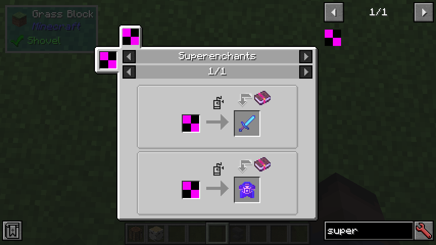
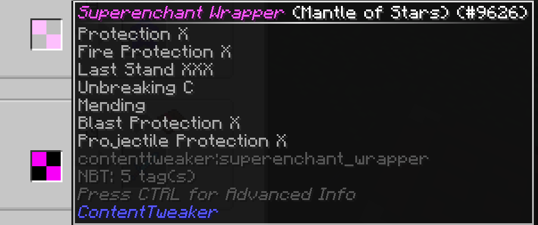
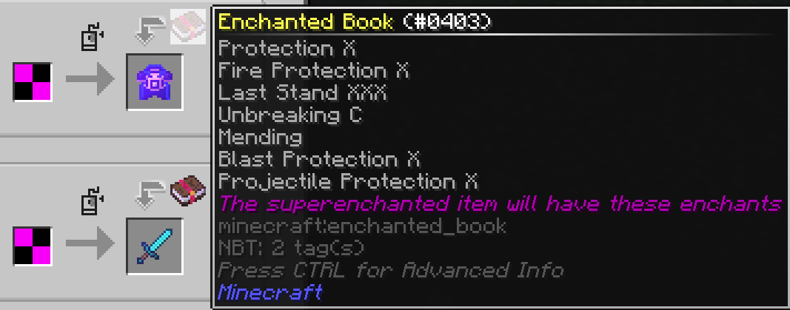
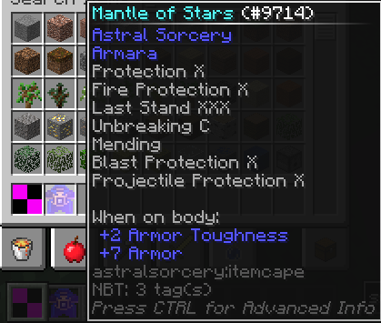
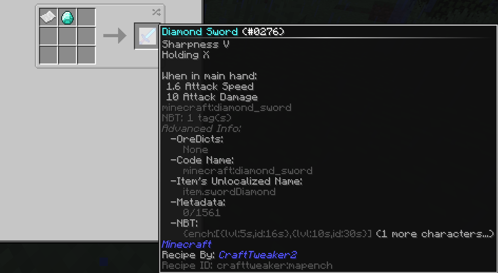

# CT-EnchantWrapper
This set of CraftTweaker scripts are for MC 1.12.2. They can aid modpack makers who may want to make recipes for enchanted items, but don't want to worry about the id shift that occurs when removing/adding enchants to existing worlds. Some changes are required to adapt recipes to this script. The result will be  recipes that output enchanted items instead output a wrapper item that gives the player the superenchanted item once right-clicked.

## How to Use
### Required Mods
- CraftTweaker
- ContentTweaker
- [ZenUtils](https://www.curseforge.com/minecraft/mc-mods/zenutil)
- [RandomTweaker](https://www.curseforge.com/minecraft/mc-mods/randomtweaker) (For JEI integration)

### Steps
1) Download the repo zip [here](https://github.com/jchung01/CT-EnchantWrapper/archive/refs/heads/main.zip) and extract. 
2) Copy-paste, or drag and drop the `resources/` and `scripts/` folder to your pack instance.
3) In the script(s) where you want to use this wrapper, import the following:
```
import scripts.EnchantUtil.EnchantMap;
import scripts.EnchantWrapper.SuperEnchantedItem;
```
4) When adding a recipe, specify the resultant/output `IItemstack` like so:
```
// The IItemStack you would normally specify as the output for the recipe.
val output = {your item here} as IItemStack;
// Build your enchantment list.
val enclist as EnchantMap = EnchantMap()
  .add({enchant1 id}, {enchant1 level})
  .add({enchant2 id}, {enchant2 level})
  ...;
// Use this as the recipe's new output.
val newOutput = SuperEnchantedItem(output, enclist).getItem();  // Make sure to get the IItemStack!
// Example with vanilla crafting.
recipes.addShapeless(name, newOutput, inputs);
```
See [example_recipes.zs](./example/example_recipes.zs) for concrete examples.

### Result
If you did everything correctly, you should see a new ContentTweaker item with the id `contenttweaker:superenchant_wrapper` and searching its uses will show a custom JEI tab like this (using `example_recipes.zs` in this picture):   
Left: The superenchant wrapper item with all the info of the item:  
  
Right: The output/superenchanted item with the associated enchants on an enchanted book (purely for visual purposes):  
  

When a player crafts the wrapper item, all they need to do is **right-click** it (consumed) to receive the superenchanted item.  
  

## Motive
In Minecraft 1.12.2, enchantments are stored as numeric ids in the NBT of an item. Each world has its own mapping of ids to enchantments. When enchants are added/removed from the game (such as removing/adding mods or disabling enchants of mods in their config), the game will try to maintain its original mapping of numeric ids to enchantments.  

This is all fine, but due to a limitation in CraftTweaker (CT), recipes added by CT only use the "global" mapping of ids to enchantments, not the world-specific ones. This will cause recipes added by CT that have enchants to sometimes have their enchantment ids shifted to completely different enchants. Which enchants shift completely depend on the difference of numeric ids between the "global" mapping and the world-specific mapping.  
Here is an example of an enchanted item that is affected by this enchantment shift due to removing/adding Cyclic:   
This recipe was added in `example_recipes.zs` using the format from the [example in the CT wiki](https://docs.blamejared.com/1.12/en/Vanilla/Enchantments/IEnchantmentDefinition#example) and is supposed to output a sword with Sharpness 5 and Vorpal 10, but Holding has replaced Vorpal due to the id shift.

## Notes
- The scripts are meant to be loaded in a specific order. Any other scripts that use the wrapper scripts should have `-10 < priority < 9`, although you can change these priorities if necessary, as long as you keep the order.

The JEI integration to display a custom "recipe" for these wrapper conversions is quite hacky. The hacks are necessary because JEI does not know the world-specific id mapping until the world is loaded, and we can't reload JEI (or at least shouldn't). Below are some things you may notice about the JEI integration:
- If you add a high level enchant to the recipe, the wrapper item in JEI will have a numeric level (instead of Roman numerals) for that enchant in the tooltip. Please ignore this, it does not affect the desired outcome in any way.
- The list of enchants in the JEI display are on an enchanted book due to limitations in how I can display the superenchanted item in JEI. Hopefully the tooltips I added are clear enough.  
(Technical: Transforming the item in JEI to directly show its enchants is possible, but then you lose the ability to search for the recipe for this superenchanted item, which is why I opted for this visual representation.)

## Credits
- Assets are re-edits of GUI assets from the Create mod [here](https://github.com/Creators-of-Create/Create/blob/mc1.18/dev/src/main/resources/assets/create/textures/gui/icons.png) and [here](https://github.com/Creators-of-Create/Create/blob/mc1.18/dev/src/main/resources/assets/create/textures/gui/jei/widgets.png).
- Idea is inspired by TheComputerizer's DimHopperTweaks custom [RecipeFunction](https://github.com/TheComputerizer/Dimension-Hopper-Tweaks/blob/master/src/main/java/mods/thecomputerizer/dimhoppertweaks/registry/items/RecipeFunction.java) item. Their item is more advanced as it is made directly in Java. However, it is specifically made for the Dimension Hopper pack so its use case may be more limiting than these scripts.